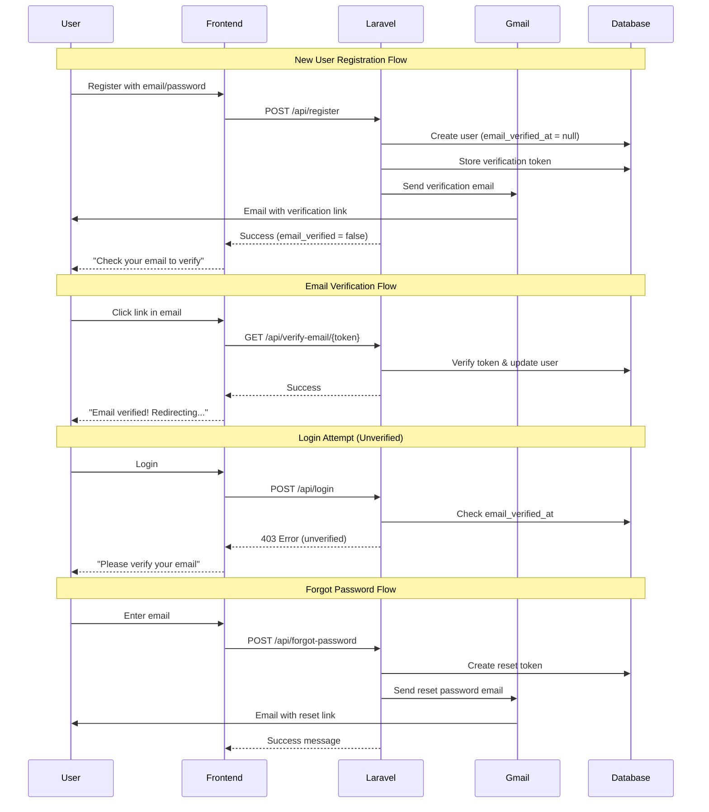

# Gmail SMTP Email Verification Setup

## Step 1: Gmail App Password Setup Instructions

Before we begin, you need to create a Gmail App Password for `tarek.zaghloul@rkiehsolutions.com`:

1. Go to https://myaccount.google.com/security
2. Enable 2-Factor Authentication (if not already enabled)
3. Go to https://myaccount.google.com/apppasswords
4. Select "Mail" and "Other (Custom name)"
5. Enter "Islamic Soundcloud" as the name
6. Click "Generate"
7. Copy the 16-character password (it will look like: `abcd efgh ijkl mnop`)
8. Keep this password ready - you'll paste it in the next step

## Step 2: Configure Laravel SMTP Settings

Update [`laravel/.env`](laravel/.env) to add Gmail SMTP configuration:

```env
MAIL_MAILER=smtp
MAIL_HOST=smtp.gmail.com
MAIL_PORT=587
MAIL_USERNAME=tarek.zaghloul@rkiehsolutions.com
MAIL_PASSWORD=<paste-your-16-char-app-password-here>
MAIL_ENCRYPTION=tls
MAIL_FROM_ADDRESS=tarek.zaghloul@rkiehsolutions.com
MAIL_FROM_NAME="Islamic Soundcloud"
```


## Step 3: Database Migration for Email Verification

Create migration to add `email_verification_token` column:

- File: `laravel/database/migrations/YYYY_MM_DD_HHMMSS_add_email_verification_to_users.php`
- Add `email_verification_token` (nullable string)
- Mark existing users as verified (`email_verified_at = now()` where `email_verified_at IS NULL`)

## Step 4: Create Email Templates

Create two Laravel Mailable classes:**a) VerifyEmailMail** - For new registrations

- Subject: "Verify Your Email - Islamic Soundcloud"
- Contains verification link: `{FRONTEND_URL}/verify-email/{token}`
- Professional design with logo

**b) ResetPasswordMail** - For forgot password

- Subject: "Reset Your Password - Islamic Soundcloud"
- Contains reset link: `{FRONTEND_URL}/reset-password?token={token}&email={email}`
- Professional design with logo

Create corresponding Blade templates in `laravel/resources/views/emails/`:

- `verify-email.blade.php`
- `reset-password.blade.php`

## Step 5: Update AuthController

Update [`laravel/controllers/AuthController.php`](laravel/controllers/AuthController.php):**register() method:**

- Generate email verification token
- Save token to `email_verification_token` column
- Send `VerifyEmailMail`
- Return response with `email_verified: false`
- DO NOT allow login until verified

**login() method:**

- Check if `email_verified_at` is null
- If unverified, return 403 error: "Please verify your email before logging in"
- Provide option to resend verification email

**forgotPassword() method:**

- Remove development mode `reset_token` and `reset_url` from response
- Send `ResetPasswordMail` instead of returning token
- Only return: `{ "message": "If your email is registered, you will receive a password reset link." }`

**New methods:**

- `verifyEmail($token)` - Verify token and mark user as verified
- `resendVerification($email)` - Resend verification email

## Step 6: Update API Routes

Update [`laravel/routes/api.php`](laravel/routes/api.php):

```php
// Email verification (public routes)
Route::get('/verify-email/{token}', [AuthController::class, 'verifyEmail']);
Route::post('/resend-verification', [AuthController::class, 'resendVerification']);
```


## Step 7: Frontend - Email Verification Page

Create new page: [`frontend/src/pages/VerifyEmail.jsx`](frontend/src/pages/VerifyEmail.jsx)

- Extract token from URL params
- Call `api.verifyEmail(token)` on mount
- Show success/error message
- Redirect to login after 3 seconds on success
- Show "Resend Email" button on error

## Step 8: Frontend - Update Register Flow

Update [`frontend/src/pages/Register.jsx`](frontend/src/pages/Register.jsx):

- After successful registration, show message: "Account created! Please check your email to verify."
- DO NOT store token or redirect to home
- Show "Resend Verification Email" button
- Redirect to login page after showing message

## Step 9: Frontend - Update Login Flow

Update [`frontend/src/pages/Login.jsx`](frontend/src/pages/Login.jsx):

- Handle 403 error for unverified email
- Show error message: "Please verify your email before logging in"
- Provide "Resend Verification Email" button
- Link to `/verify-email` page with instructions

## Step 10: Frontend - API Service Updates

Update [`frontend/src/services/api.js`](frontend/src/services/api.js):

- Update `verifyEmail` to accept token parameter
- Add `resendVerification(email)` method

## Step 11: Remove Admin Panel Development Mode

Update [`frontend/src/pages/AdminPanel.jsx`](frontend/src/pages/AdminPanel.jsx):

- Remove "Generate Reset Link" button from user management
- Remove related handler function
- Users should use the normal "Forgot Password" flow

Update [`frontend/src/services/api.js`](frontend/src/services/api.js):

- Remove `generateResetLink` method from admin API calls

## Step 12: Mark Existing Users as Verified

Create one-time migration script to mark all existing users as verified:

- Update all users where `email_verified_at IS NULL` to set `email_verified_at = created_at`
- This ensures existing users can continue logging in

## Step 13: Testing Checklist

After deployment, test:

1. Register new user → Receive email → Click verification link → Login
2. Login with unverified email → See error → Resend email → Verify → Login
3. Forgot password → Receive email → Reset password → Login
4. Existing users can still login (auto-verified)
5. Resend verification works
6. Email links are properly formatted with correct domain

## Architecture Diagram




## File Changes Summary

**Backend (Laravel):**

- `laravel/.env` - Add SMTP configuration
- `laravel/database/migrations/*_add_email_verification_to_users.php` - New migration
- `laravel/app/Mail/VerifyEmailMail.php` - New Mailable class
- `laravel/app/Mail/ResetPasswordMail.php` - New Mailable class
- `laravel/resources/views/emails/verify-email.blade.php` - New email template
- `laravel/resources/views/emails/reset-password.blade.php` - New email template
- `laravel/controllers/AuthController.php` - Update register, login, forgotPassword; add verifyEmail, resendVerification
- `laravel/routes/api.php` - Add verification routes

**Frontend (React):**

- `frontend/src/pages/VerifyEmail.jsx` - New page
- `frontend/src/pages/Register.jsx` - Update post-registration flow
- `frontend/src/pages/Login.jsx` - Handle unverified error, add resend button
- `frontend/src/pages/AdminPanel.jsx` - Remove generate reset link button
- `frontend/src/services/api.js` - Update verifyEmail, add resendVerification, remove generateResetLink

**Deployment:**

- Deploy migrations